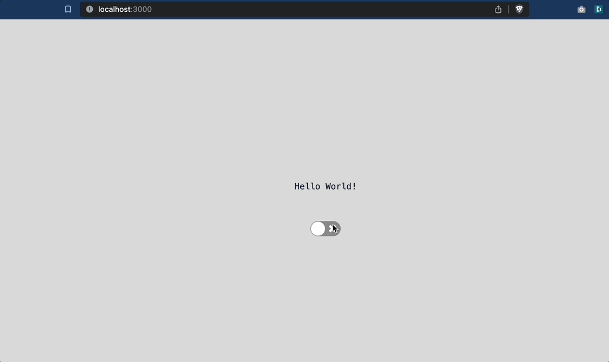

# Dark and Light Mode
This basic project with react.

## Installing and Running the Project

In the project directory, you can run:

```sh
npm install  
```

Runs the app in the development mode.\
Open [http://localhost:3000](http://localhost:3000) to view it in your browser.
```sh
npm start
```
## Screenshot


